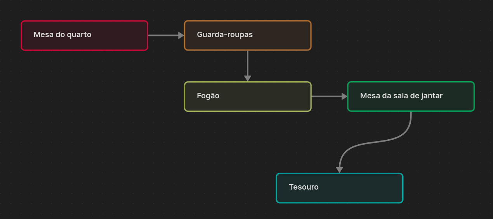
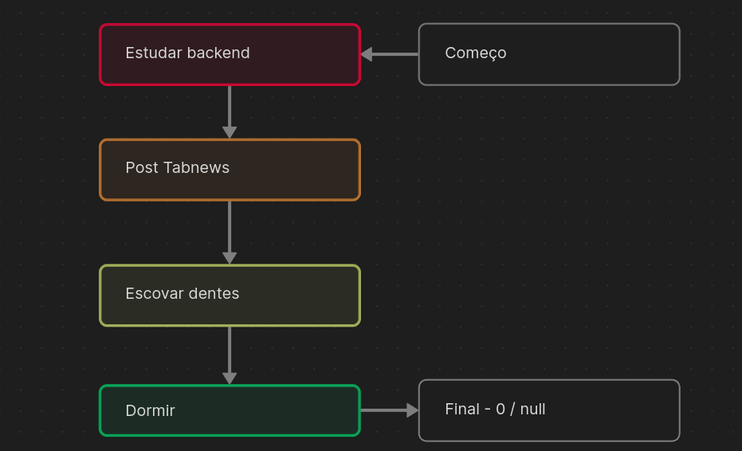
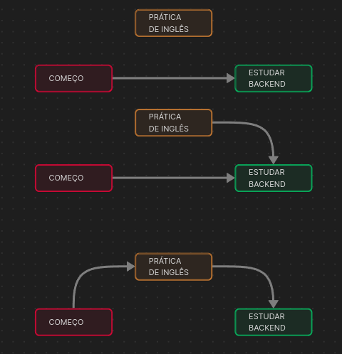
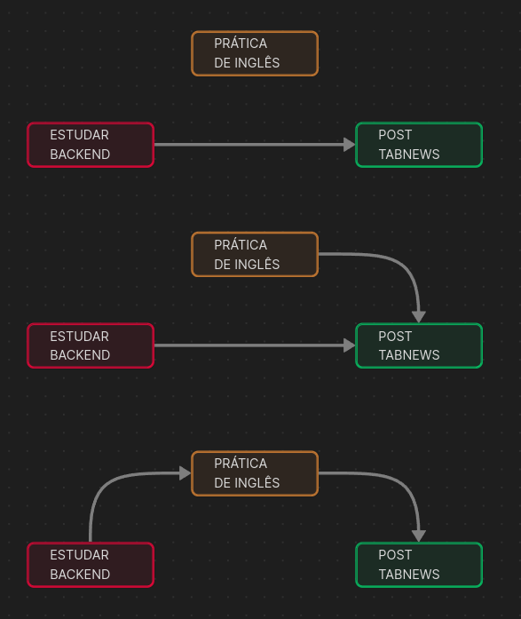
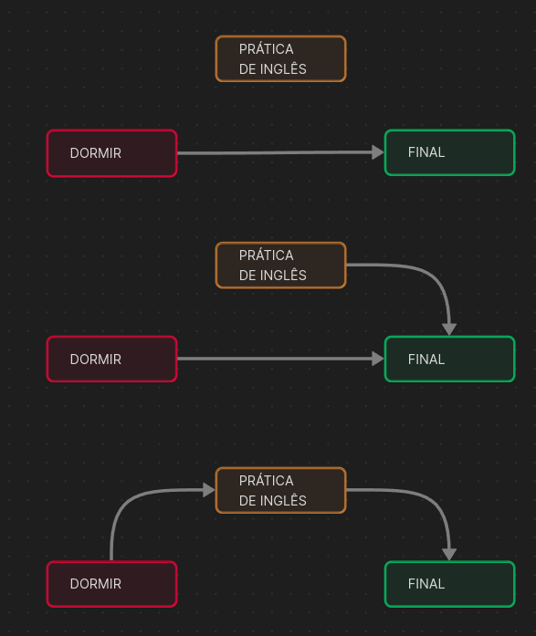
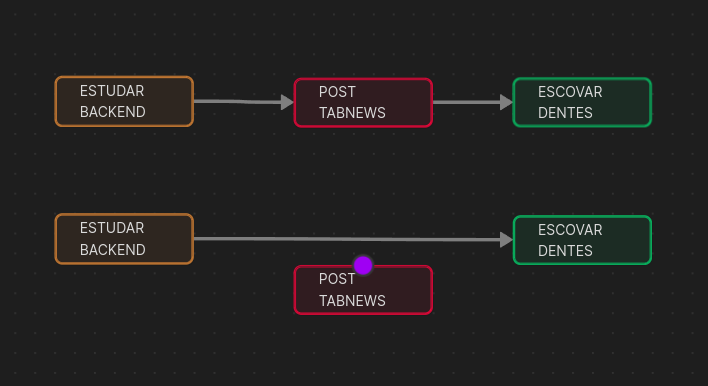

Imagine uma busca ao tesouro. Inicialmente, você recebe um cartão que informa que o tesouro está guardado na `mesa do quarto`. Ao chegar lá, encontra outro cartão, indicando que o tesouro está dentro do `guarda-roupas`. No entanto, dentro do guarda-roupas, há mais um cartão que revela que o tesouro está dentro do `fogão na cozinha`. Ao chegar ao fogão, outro cartão indica que o tesouro está debaixo da `mesa na sala de jantar`. Enfim, você encontrou o `tesouro`.

**Mapa do tesouro**



**Podemos notar que:**

-   Para alcançarmos o tesouro, necessitamos de um ponto de partida (o cartão).
-   O cartão não é parte integrante da sequência.
-   Cada ponto é composto pela localização do próprio ponto e de uma indicação para o próximo local.
-   O ponto final(o tesouro), não aponta para um próximo ponto.

Isso é um exemplo daquilo que chamamos de `lista encadeada`, que se define por um conjunto de elementos individualizados em que cada um referencia o outro como sucessor.

## Lista de tarefas

Podemos utilizar `listas encadeadas` em nosso cotidiano. Como exercício, crie uma lista de tarefas com qualquer coisa que venha à mente, sem se preocupar com a ordem.

**exemplo**

<table border="1">
    <thead>
        <th>#</th>
        <th>Item</th>
    </thead>
    <tbody>
        <td>1</td>
        <td>Dormir</td>
        </tr>
        <td>2</td>
        <td>Estudar backend</td>
        </tr>
        <td>3</td>
        <td>Escovar Dentes</td>
        </tr>
        <td>4</td>
        <td>Post Tabnews</td>
    </tbody>
</table>

Esta tabela pode parecer um pouco confusa, pois não há uma ordem aparente.

No entanto, com `Listas encadeadas`, mesmo sem uma ordem definida, é possível determinar qual será o próximo valor.

**começo: 2**

<table border="1">
    <thead>
        <th>#</th>
        <th>Item</th>
        <th>Próximo</th>
    </thead>
    <tbody>
        <td>1</td>
        <td>Dormir</td>
        <td>Final</td>
        </tr>
        <td>2</td>
        <td>Estudar backend</td>
        <td>4</td>
        </tr>
        <td>3</td>
        <td>Escovar Dentes</td>
        <td>1</td>
        </tr>
        <td>4</td>
        <td>Post Tabnews</td>
        <td>3</td>
    </tbody>
</table>

Desta maneira, apenas indicamos qual será a próxima tarefa a ser realizada, sem necessidade de modificar a ordem atual da tabela.

### Declaração

Podemos representar nossa lista de tarefas com um `vetor de registros`

```pascal
type reg : register
    caracter: item;
    integer: PROX;
end;

type VET = vector [1...100] of reg;
VET: list;

integer: comeco;
comeco <- 2;
```

Usaremos a variavel `comeco` como `referência` ao ponto de partida da lista e o valor `0` ou `null` como final.



## Manipulação

As **operações mais comuns** em **listas encadeadas** são a **inserção** e a **remoção**. O objetivo deste artigo é **destacar alguns pontos importantes** sobre esse tema. Caso você não saiba o que são **listas encadeadas**, recomendo acessar o **artigo anterior** que trata desse assunto.

### Inserção

Nas **listas encadeadas**, as posições não são tão importantes. Isso ocorre devido à **independência dos elementos**; cada elemento pode estar logicamente encadeado em **qualquer lugar da lista**.

Diferentemente de estruturas como **pilhas** e **filas**, as listas encadeadas oferecem mais liberdade. Você pode **inserir elementos no início, meio ou final** da lista, e até mesmo **ordená-los de forma crescente ou decrescente**. Além disso, a **remoção** também pode ocorrer em qualquer parte da lista.

Dada a seguinte lista encadeada:

**começo: 2**

<table border="1">
    <thead>
        <th>#</th>
        <th>Item</th>
        <th>Próximo</th>
    </thead>
    <tbody>
        <td>1</td>
        <td>Dormir</td>
        <td>Final</td>
        </tr>
        <td>2</td>
        <td>Estudar backend</td>
        <td>4</td>
        </tr>
        <td>3</td>
        <td>Escovar Dentes</td>
        <td>1</td>
        </tr>
        <td>4</td>
        <td>Post Tabnews</td>
        <td>3</td>
    </tbody>
</table>

Insira a seguinte tarefa: **Pratica de inglês**

**Inserção no INICIO**



```pascal
VET[5].prox <- comeco; //PRIMEIRO PASSO
começo <- 5; // SEGUNDO PASSO
```

**Inserção no MEIO**



```pascal
VET[5].prox <- VET[2].prox; //PRIMEIRO PASSO
VET[2].prox <- 5; // SEGUNDO PASSO
```

**Inserção no FINAL**



```pascal
VET[5].prox <- null; //PRIMEIRO PASSO
VET[1].prox <- 5; // SEGUNDO PASSO
```

Notou algo? Está havendo uma repetição de código desnecessária. Portanto, vamos criar um método para inserir valores em nossa lista.

```pascal
modulo inserir(int: novo, int: antecessor) {
	VET[novo].prox <- antecessor;
	antecessor <- novo;
}
```

Reduzimos as inserções a:

```pascal
inserir(5, comeco); //INSERI NO INICIO
inserir(5, VET[2].prox); //INSERI NO MEIO
inserir(5, VET[1].prox); //INSERI NO FINAL
```

### Remoção

Para um fácil entendimento, considere que os elementos removidos são ‘desligados’ da lista, ou seja, **desvinculados**. Não se preocupe com **memória** ou algo do tipo.

**Exemplo de remoção**



```pascal
VET[2].prox <- VET[4].prox;
```

Claro que existem formas para otimizar tanto a **inserção** quanto a **remoção**. No entanto, a base de tudo é essa.

Agradeço pela a atenção! 🚀
