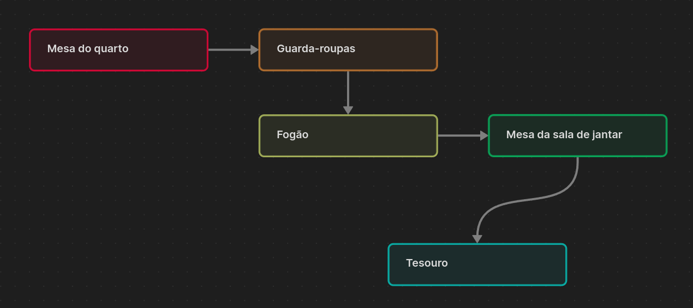
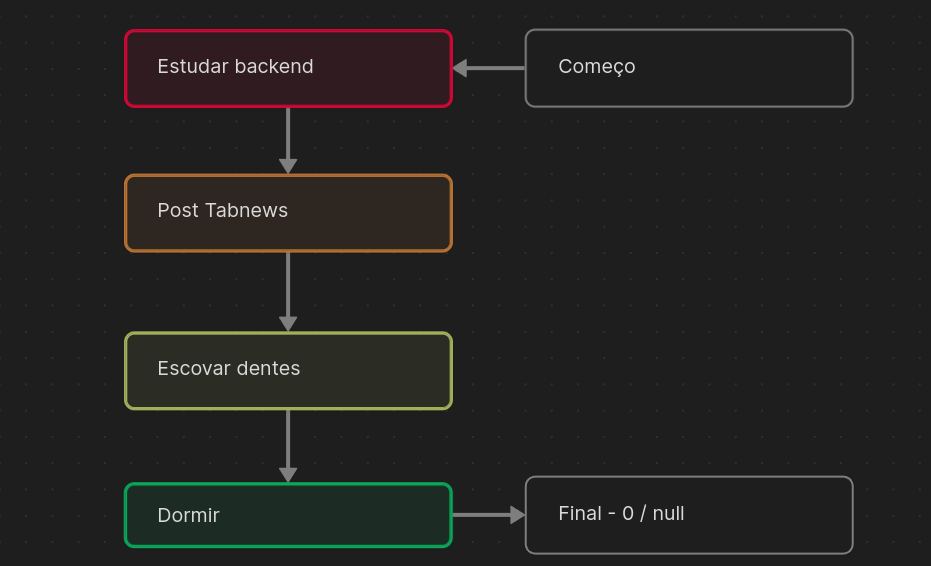

Imagine uma busca ao tesouro. Inicialmente, você recebe um cartão que informa que o tesouro está guardado na `mesa do quarto`. Ao chegar lá, encontra outro cartão, indicando que o tesouro está dentro do `guarda-roupas`. No entanto, dentro do guarda-roupas, há mais um cartão que revela que o tesouro está dentro do `fogão na cozinha`. Ao chegar ao fogão, outro cartão indica que o tesouro está debaixo da `mesa na sala de jantar`. Enfim, você encontrou o `tesouro`.

**Mapa do tesouro**



**Podemos notar que:**

-   Para alcançarmos o tesouro, necessitamos de um ponto de partida (o cartão).
-   O cartão não é parte integrante da sequência.
-   Cada ponto é composto pela localização do próprio ponto e de uma indicação para o próximo local.
-   O ponto final(o tesouro), não aponta para um próximo ponto.

Isso é um exemplo daquilo que chamamos de `lista encadeada`, que se define por um conjunto de elementos individualizados em que cada um referencia o outro como sucessor.

## Lista de tarefas

Podemos utilizar `listas encadeadas` em nosso cotidiano. Como exercício, crie uma lista de tarefas com qualquer coisa que venha à mente, sem se preocupar com a ordem.

**exemplo**

<table border="1">
    <thead>
        <th>#</th>
        <th>Item</th>
    </thead>
    <tbody>
        <td>1</td>
        <td>Dormir</td>
        </tr>
        <td>2</td>
        <td>Estudar backend</td>
        </tr>
        <td>3</td>
        <td>Escovar Dentes</td>
        </tr>
        <td>4</td>
        <td>Post Tabnews</td>
    </tbody>
</table>

Esta tabela pode parecer um pouco confusa, pois não há uma ordem aparente.

No entanto, com `Listas encadeadas`, mesmo sem uma ordem definida, é possível determinar qual será o próximo valor.

**começo: 2**

<table border="1">
    <thead>
        <th>#</th>
        <th>Item</th>
        <th>Próximo</th>
    </thead>
    <tbody>
        <td>1</td>
        <td>Dormir</td>
        <td>Final</td>
        </tr>
        <td>2</td>
        <td>Estudar backend</td>
        <td>4</td>
        </tr>
        <td>3</td>
        <td>Escovar Dentes</td>
        <td>1</td>
        </tr>
        <td>4</td>
        <td>Post Tabnews</td>
        <td>3</td>
    </tbody>
</table>

Desta maneira, apenas indicamos qual será a próxima tarefa a ser realizada, sem necessidade de modificar a ordem atual da tabela.

### Declaração

Podemos representar nossa lista de tarefas com um `vetor de registros`

```pascal
type reg : register
    caracter: item;
    integer: PROX;
end;

type VET = vector [1...100] of reg;
VET: list;

integer: comeco;
comeco <- 2;
```

Usaremos a variavel `comeco` como `referência` ao ponto de partida da lista e o valor `0` ou `null` como final.


