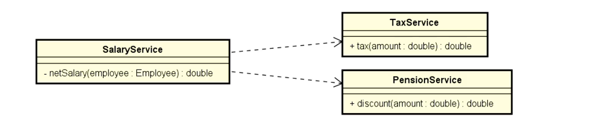

# Sistema e Componentes

O ideal é que o `sistema` seja divido em `componentes`, onde cada componente efetua uma ação.

Por exemplo um sistema de `delivery`.

## Sistema de Delivery - Componentes

-   **Cadastrar produto**
-   **Cadastrar clientes**
-   **Comprar produto**
-   **Efetuar pagamento**
-   **Validar pagamento**
-   **Enviar produto**

Veja como podemos dividir o sistema em diversos componentes, onde cada um deve ter uma `única resposabilidade`.

## Componentes devem ser

-   **_Coesos_:** Responsabilidade clara e única.
-   **_Desacoplados entre si_:** Componentes não devem depender uns dos outros.

## Objetivos em USAR Componentes

-   **_Flexibilidade_:** Um sistema onde os componentes podem ser aproveitados em diferentes locais.
-   **_Manutenção Fácil_:** A implementação de componentes facilita a manutenção de código.

## Exemplo Didático

Fazer um programa que leia o `nome` e `salário bruto` do funcionario. Mostrar o `salário líquido`, que consiste no valor bruto descontado `impostos` e `previdência`.

-   **Impostos**: 20%
-   **Previdência**: 10%

### Componentes

-   **Salary Service**: Esse componente terá o método `netSalary` que calculara o salário líquido.
-   **Tax Service**: Esse componente terá o método `tax` que calculara os impostos.
-   **Pension Service**: Esse componente terá o método `discount` que calculara a previdência.

### Diagrama

### Código fonte

<a href="exemplos/NetSalary/src/">Source code</a>
